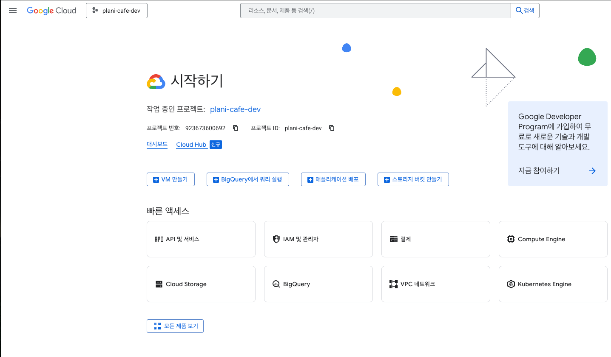
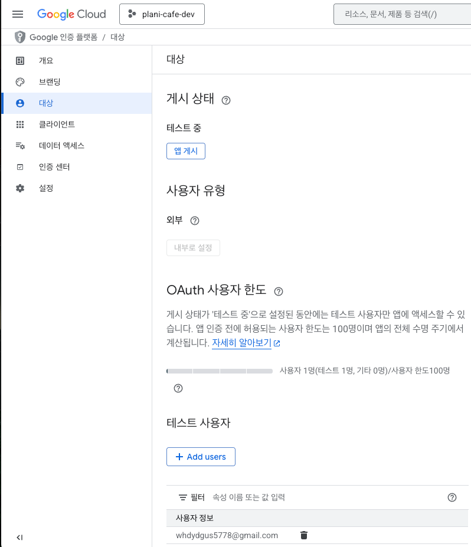
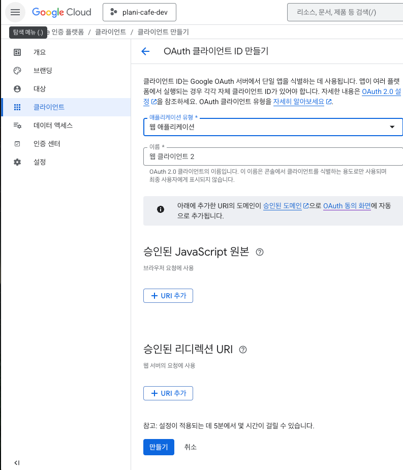

## 1단계 - Google Cloud Console 에서 새 프로젝트 생성

[Google Cloud Console](https://console.cloud.google.com/) 에서 프로젝트 생성



- Google Cloud -> 새 프로젝트 생성 (`plani-cafe-dev`)
- **이 프로젝트가 OAuth 설정, Client ID 발급의 기준이 된다.**
- **Google OAuth2 인증을 사용하려면 반드시 Google CLoud 의 프로젝트 단위로 클라이언트 정보를 관리해야 함**

---

## 2단계 - OAuth2 동의 화면 구성



- 외부 사용자 선택 (일반 서버시는 외부 사용자를 선택해야 함)
- 앱 정보 입력
- 범위 (Scopes) 자동 등록
- 필요시 텍스트 사용자도 등록 가능 (현재 Test Mode 라 테스트 사용자만 인증 가능)

### 왜 필요함?
- 이 화면에서 Google 은 `"이 앱에서 어떤 정보를 가져갈 건지"를 사용자에게 보여준다.`
- `Test mode`에서는 **등록된 계정만 로그인 가능**

---

## 3단계 - OAuth 2.0 Client ID 생성



- 클라이언트 유형: **웹 애플리케이션**
- Client ID 이름: `plani-cafe-oauth-client`

### 왜 애플리케이션임?
- **Spring Boot OAuth2 는 google 로부터 서버 측 리다이렉트 콜백을 받아야 한다.**

### 리디렉션 URI 형태

```bash
# 이 구조는 웹 서버 방식이 아니면 사용 불가
http://localhost:8070/login/oauth2/code/google
```

---

## 4단계 - Authorized Redirect URI 등록

```bash
# google OAuth 인증 성공 후 돌아올 주소
# Spring Security 가 자동으로 처리하는 URL 패턴
http://localhost:8070/login/oauth2/code/google
```

---

## 5단계 - Client ID, Client Secret 생성 완료
- `Google Client ID` 발급 됨
- `Google Client Secret` 발급 됨

---

## 정리

1. **Google Cloud 프로젝트 생성**
2. **OAuth 동의 화면 생성 & 테스트 모드 설정**
3. **OAuth2 Client ID 생성 (웹 애플리케이션)**
4. **Authorized redirect URI 등록**
5. **Client ID / Secret 발급 완료**
